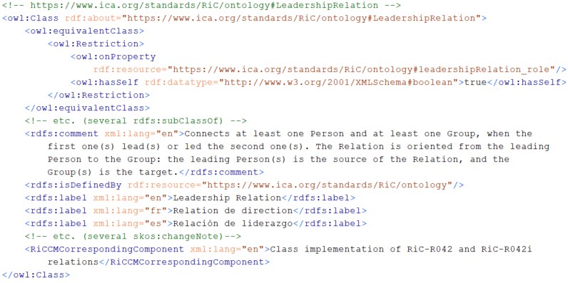

# Migrating data from RiC-O 0.2 to RiC-O 1.0

* [Home](index.html)
* [About RiC-O](about.html)
* [Why use RiC-O?](why-use-RiC-O.html)
* [Diagrams](diagrams.html)
* [Examples](examples.html)
* **Migrating data from RiC-O 0.2 to RiC-O 1.0**
* [Events and presentations](events.html)
* [Projects, tools, and resources](projects-tools-resources.html)
* [Next steps](next-steps.html)

Last updated on February 5th, 2024

Though the following information and recommendations do not for now pretend to be exhaustive, we hope that they can help the teams which have already produced datasets conforming to RiC-O (thus to RiC-0 0.2) to make them compliant with RiC-O 1.0.

**RiC-O 1.0**, which is the first stable and complete version of RiC ontology, and thus a major milestone in the development of the standard, **introduces some new components; it also brings some changes on the specifications of the v0.2 components**: the qualified names, definitions, domains or ranges of some have changed. Besides, some components have been removed. In other words, RiC-O 1.0 is not, as a whole, compatible with RiC-O 0.2. This is why, **if you have been using RiC-O 0.2 and want to move to the first official version of the RiC ontology (which we would recommend), you may need to modify your data**.

We will mainly **focus on the most significant changes made to RiC-O 0.2 components**, starting with the ones that concern the core of RiC-O (i.e. everything but the Relation classes and their properties). We will also emphasize some additions that may be very useful in some projects.

**Before modifying your data**, in order to get a more precise understanding of what has to be done in your dataset, **you should, in addition to reading this text**:
- **open the ontology file in an OWL ontology editor, browse it or directly search the component you have in mind**; any change made to an existing component has been documented precisely;
- **have a look at the [three CSV files provided](https://github.com/ICA-EGAD/RiC-O/tree/master/ontology/current-version/CSV_lists_of_components)**, whose last column lists the changes made from RiC-O 0.2 for each component.

In the following lines, we use the `rico:` prefix only for RiC-O 1.0 components.

## Changes affecting the core of RiC-O

### A new model for Dates

Though this is the main change, it will affect your data only if you have instantiated the Date classes. In many projects, dates are expressed using RiC-O datatype properties, where almost nothing has changed.

**The three v0.2 subclasses of the `rico:Date` class (*DateSet*, *DateRange* and *SingleDate*) have been removed**. As a consequence, any instance of these classes should be modified and declared as being of type `rico:Date`.

In addition to these changes:
- a `rico:DateType` class was created along with the object properties needed to connect its instances to Date entities (`rico:hasDateType` and `rico:isDateTypeOf`).
- the `rico:normalizedDateValue` datatype property remains available, and can be used for storing a date in e.g. ISO 8601 or EDTF format; of course it also can be used along with W3C date datatypes.
- the `rico:qualifier` datatype property can be used to specify the certainty or precision of the date when needed (the former certainty attribute was replaced with a `rico:relationCertainty` attribute whose domain has been reduced to Relation).
- the *dateStandard* and *calendar* datatype properties were removed: the calendar and standard used to specify a normalized date value or a natural language expression of a date are to be declared for each specific value of `rico:normalizedDateValue` or `rico:expressedDate`, using, among other possibilities, a W3C date datatype, or creating subproperties of these properties when needed.

### Changes made to other 'core' classes 

A `rico:MandateType` class was created, as a subclass of `rico:RuleType`, along with the two object properties needed to connect instances of this class to instances of `rico:Mandate`.

### Changes made to the 'core' datatype properties

In addition to the datatype properties whose domain is rico:Date and which are quoted above, **you should pay attention to the following changes**:
- ***descriptiveNote***, which had domain `rico:Thing` and is therefore most probably being very widely used, **was replaced with `rico:generalDescription`**, with a slightly different textual definition; `rico:scopeAndContent` was made a subproperty of `rico:generalDescription`. 
- ***accrual* was replaced with `rico:accruals`**, and *accrualStatus* with rico:accrualsStatus`.
- *integrity* was replaced with `rico:integrityNote` (with domain `rico:RecordResource` only) and *physicalCharacteristics* with `rico:physicalCharacteristicsNote`; *qualityOfRepresentation* was replaced with `rico:qualityOfRepresentationNote` and made a subproperty of `rico:physicalCharacteristicsNote`.

A new `rico:length` property was created, subproperty of `rico:measure`, with domain `rico:Thing`.

A new `rico:destructionDate` property was created, subproperty of `rico:endDate`, with domain `rico:RecordResource`. 

### Changes made to the 'core' object properties

The following changes have been made:
- ***hasInstantiation*  was replaced with `rico:hasOrHadInstantiation`** (same for the inverse object property, which is now `rico:isOrWasInstantiationOf`)
- ***hasDerivedInstantiation* was replaced with `rico:hasOrHadDerivedInstantiation`** (same for the inverse property, which is now `rico:isOrWasDerivedFromInstantiatio`n)
- ***hasProvenance* was replaced with `rico:hasOrganicProvenance*`**, subproperty of the new `rico:hasOrganicOrFunctionalProvenance`; `rico:documents` was also made a subproperty of this new property; same for the inverse properties
- ***hasSource* (whose domain was the union of RecordResource and Relation) was removed**; a new `rico:isEvidencedBy` property has been created, with domain `rico:Relation` only; same for the inverse property, *isSourceOf*
- **`rico:precedesInTime` and `rico:followsInTime` were made transitive**.

In addition to these changes, **many object properties have been added, which may help to produce more precise data, or data which would be easier to process**. The inverse properties were also created, though we are not mentioning them below.
- **several properties were added with domain the union of `rico:RecordResource` and `rico:Instantiation`, or `rico:RecordSet`, and with range `rico:Date`**: `rico:hasPublicationDate`, `rico:hasCreationDate`, `rico:hasDestructionDate`; plus several properties to specify the creation dates of all, some or most members of a `rico:RecordSet`. Most often, when you assign dates to a Record Set, you mean the dates of its members - you don't know the date when the Record Set was formed; in such a case you should not use `rico:hasCreationDate`, but the properties that concern the members of the Record Set (e.g. `rico:hasOrHadMostMembersWithCreationDate`). A notable exception may be the case where the Record Set is a collection: you may know both the date when the collection was created, and the dates of the records that are included in the collection. In such a case you should use both properties.
- two properties were created with domain and range `rico:Date`: `rico:intersects` and `rico:isWithin`;
- a new `rico:occurredAtDate` property was created with domain `rico:Event` and range `rico:Date`;
- two subproperties were added to `rico:hasOrHadInstantiation`: `rico:hasOrHadDigitalInstantiation` (which can be used, for example, when you generate a `rico:Instantiation` from a `dao` EAD element), and `rico:hasOrHadAnalogueInstantiation`; 
- several properties were created with domain and range `rico:Agent` or subclasses of this class: `rico:wasMergedInto` and `rico:wasSplitInto`, `rico:isOrWasEmployerOf`, `rico:hasBirthPlace`, `rico:hasDeathPlace`.

Last but not least, **object properties have been created under the following existing properties, in order to distinguish past and present relations, and, as concerns present relations, to get transitive properties**: 
- `rico:followsOrFollowed` (with domain `rico:Thing`) and `rico:hasOrHadPart` (with domain `rico:Thing`);
- `rico:includesOrIncluded` (with domain `rico:RecordSet`) ; 
- `rico:hasOrHadConstituent` (with domain the union of `rico:Record` and `rico:RecordPart`);
- `rico:hasOrHadComponent` (with domain `rico:Instantiation`) ; 
- `rico:containsOrContained` (with domain `rico:Place`) ;
- `rico:hasOrHadSubdivision` (with domain `rico:Group`);
- `rico:hasOrHadSubevent` (with domain `rico:Event`).

For example, **`rico:directlyIncludes` can now be used to connect a Record Set and its direct present members, and `rico:includesTransitive` can be inferred from this, or created, to connect a Record Set and its present, direct or indirect, members** (e.g. a fonds and an item in this fonds). This can be applied when you want to generate data from a tree of EAD `c` elements. `Rico:included` can be used to connect a Record Set and a former member of this Record Set.

The image below shows the hierarchy of properties under `rico:includesOrIncluded`, as displayed by Protégé Desktop.

**`Rico:directlyFollowsInSequence` can now be used to connect a Record Resource and its direct following sibling in a sequence of Record Resources. `Rico:followsInSequenceTransitive` can be inferred from this property, or created, to connect a Record Resource and any of its following siblings in a sequence**. This can be applied when you want to generate data from a sequence of EAD `c` elements. 
On this topic see also [issue 41](https://github.com/ICA-EGAD/RiC-O/issues/41), and [issue 97](https://github.com/ICA-EGAD/RiC-O/issues/97).

## Changes made to the system of Relation classes

**The *AgentOriginationRelation* was replaced with `rico:OrganicProvenanceRelation`**, subclass of a new `rico:OrganicOrFunctionalProvenanceRelation` class.

The *source* datatype property was replaced with `rico:relationSource` datatype property, with domain `rico:Relation`. Same for the *certainty* datatype property, which was replaced with `rico:relationCertainty`. 

As already said above, the *hasSource* object property, whose domain included `rico:Relation` and whose range was the union of `rico:Agent` and `rico:RecordResource`, was replaced with a `rico:isEvidencedBy` object property, with domain `rico:Relation` only and range `rico:RecordResource`. Same for the inverse property, *isSourceOf*, which became `rico:evidences`.

**The Relation classes have been rolified, for the reasons, and following the method and pattern, explained [here](https://github.com/ICA-EGAD/RiC-O/issues/67)**.

As a consequence:
- **166 specific object properties, defined in RiC-O to connect entities to these relations, were removed**. If you have instantiated Relation classes in your RiC-O 0.2 dataset, you should replace these object properties with the following properties, which existed already: either `rico:relationConnects` (if the Relation class used is not oriented, e.g. for `rico:AgentToAgentRelation`) or `rico:relationHasSource` and `rico:relationHasTarget` (if the Relation class used is oriented, e.g. for `rico:LeadershipRelation`);
- a new reflexive object property, whose name ends with a `_role` suffix, was defined for each of the 48 Relation classes, with domain and range the concerned class;
- the property chain axioms that had been defined for the binary shortcuts corresponding to the classes, were modified.

Again, you can read much more details about this on the page related to [issue 67](https://github.com/ICA-EGAD/RiC-O/issues/67).

Here is an example of what has changed, for a `rico:LeadershipRelation`.

Figure 1 shows how this relation is expressed using RiC-O 0.2.

Figure 2 shows how the same relation is now expressed using RiC-O 1.0.

The image below shows the RDF/XML data that corresponds to Figure 2.

The `rico:LeadershipRelation` itself is now defined as follows in RiC-O 1.0 (see the ontology file or HTML page to get the full specification):

### Warning

**Suppose you want to be able, in your dataset, to use the property path quoted in the caption of Figure 2 above (`rico:thingIsSourceOfRelation/rico:leadershipRelation_role/rico:relationHasTarget`), and any similar property path involving some `*_role` property, directly in SPARQL queries, in order to traverse the relations you have instantiated**. 

Most of graph databases do not support for now the OWL 2 `owl:hasSelf` declaration that is included in the definition or the Relation classes. So they cannot infer the triple that uses the `*_role` property and connects the instance of the Relation class to itself, from the assertion that the instance is a Relation (for example, if you assert that an entity is a `rico:LeadershipRelation`, the graph database you use will most probably not be able to infer the triple that connects this instance of the `rico:LeadershipRelation` to itself using `rico:leadershipRelation_role`).

So, in order to be able to use such property paths, **you should**, as said in a comment of the RDF/XML example above, **either also generate the triple that connects each instance of a Relation to itself in your RiC-O 1-0 dataset, before importing it into the graph database, or add it to the dataset, once imported**, using for example SPARQL Update.

Also, note that, once such property paths exist in your dataset, the shortcut triples like the two ones shown in the RDF/XML example above will be inferred automatically from the property chain axioms declared in RiC-O 1.0 by a OWL-RL reasoner. However, if your graph database is not configured to use such a reasoner and if you wish to use the shortcuts to query the data, you should also generate at least one of these two shortcut triples, either before or after importing the data in your graph base.

